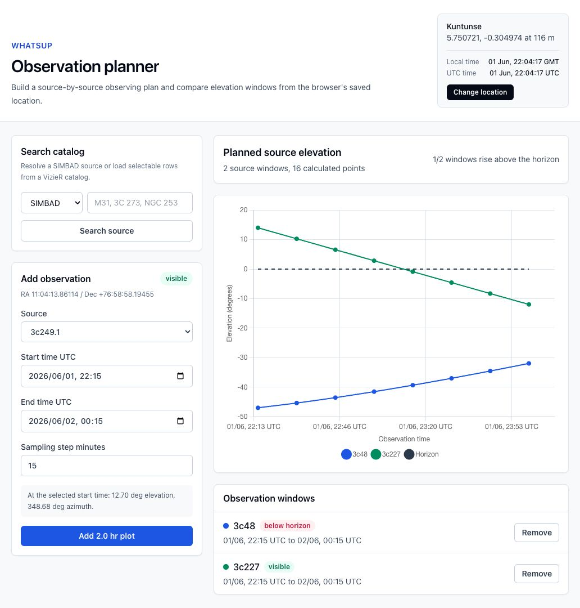
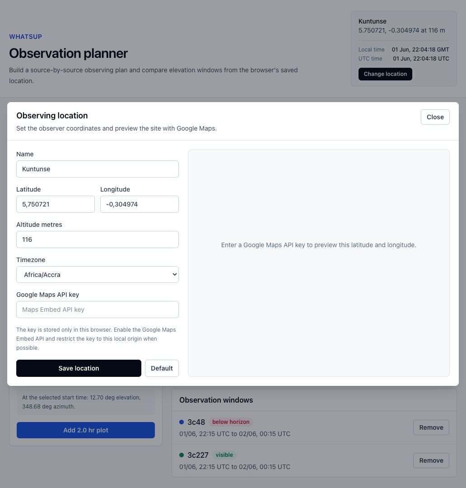

# whatsup

A small FastAPI and React app for planning observations by plotting source elevation over requested observing windows.

The original Tkinter app is still available as `whatsup.py`; the web rewrite is served by FastAPI from `backend/app/main.py`.

Live app: [https://whatsup-mu.vercel.app](https://whatsup-mu.vercel.app)

## Screenshots

Observation planner with source elevation plots:



Location setup with timezone selection:



## Tech Stack

- Frontend: React, Vite, Tailwind CSS, Chart.js
- Backend: FastAPI on Python
- Astronomy: Astropy, Astroplan, Astroquery
- Data: built-in CSV source catalog, SIMBAD/VizieR catalog lookups, no database
- Browser state: `localStorage` for observing location and Google Maps API key
- Deployment: Vercel static output plus a Python FastAPI function

## Run

Install Python dependencies:

```bash
pip install -r pip-requirements.txt
```

Install frontend dependencies:

```bash
cd frontend
npm install
```

Run the React app with Vite during development:

```bash
npm run dev
```

Vite serves the UI at:

```text
http://127.0.0.1:5173/
```

Start the FastAPI API in another terminal:

```bash
uvicorn backend.app.main:app --reload
```

For FastAPI to serve the compiled frontend directly, build the Vite app first:

```bash
cd frontend
npm run build
```

Then open:

```text
http://127.0.0.1:8000/
```

The browser UI is a Vite React app using Tailwind CSS and Chart.js.

## Sister locations

Open `/sister-locations` or use the `Sister locations` navigation button to compare the
selected source at up to six observing sites. The page uses a fixed 12-hour window with
hourly samples, displays a compact current-weather summary for each site, and stores the
editable location list in browser `localStorage` under
`whatsup.sisterLocations.v1`.

First-time users receive five global radio-observatory presets: MeerKAT, VLA, ALMA,
Effelsberg, and Parkes / Murriyang.

## Deploy to Vercel

The repo includes Vercel configuration for deploying the FastAPI app as a Python
function and the React UI as static Vite output.

Production deployment: [https://whatsup-mu.vercel.app](https://whatsup-mu.vercel.app)

Vercel uses:

- `api/index.py` as the Python serverless entrypoint.
- `requirements.txt` for deployment Python dependencies.
- `vercel.json` to build `frontend/dist`, route `/api/*` to FastAPI, and serve the
  React app for all other paths.
- `.python-version` to request Python 3.12.

The configured Vercel build command is:

```bash
npm --prefix frontend ci && npm --prefix frontend run build
```

Deploy from the project root with the Vercel CLI or connect the repository in the
Vercel dashboard.

## Location

The default observing location comes from `location.ini`.

The web app does not use a database. When a user edits the observing location, the location is stored in that browser's `localStorage` under `whatsup.location` and sent with each plot request.

Location setup is opened from the `Change location` button. The dialog accepts latitude, longitude, altitude, and an optional Google Maps Embed API key. If a key is provided, the app embeds a Google Maps iframe centered on the entered coordinates. The key is stored only in browser `localStorage` under `whatsup.googleMapsApiKey`.

## API

List sources:

```http
GET /api/sources
```

Get the default location:

```http
GET /api/location/default
```

Check whether a source is visible at a specific time:

```http
POST /api/visibility
Content-Type: application/json

{
  "source_name": "3c48",
  "at_time": "2026-06-01T15:30:00Z",
  "location": {
    "name": "Kuntunse",
    "latitude": 5.750721,
    "longitude": -0.304974,
    "altitude": 116
  }
}
```

Plot one source:

```http
POST /api/trajectory
Content-Type: application/json

{
  "source_name": "3c48",
  "duration_hours": 10,
  "step_minutes": 30,
  "location": {
    "name": "Kuntunse",
    "latitude": 5.750721,
    "longitude": -0.304974,
    "altitude": 116
  }
}
```

Plot every source:

```http
POST /api/trajectories
Content-Type: application/json

{
  "duration_hours": 10,
  "step_minutes": 30,
  "location": {
    "name": "Kuntunse",
    "latitude": 5.750721,
    "longitude": -0.304974,
    "altitude": 116
  }
}
```

Compare one source across sister locations:

```http
POST /api/sister-trajectories
Content-Type: application/json

{
  "source_name": "3c48",
  "start_time": "2026-06-10T16:00:00Z",
  "locations": [
    {
      "name": "MeerKAT",
      "latitude": -30.713,
      "longitude": 21.443,
      "altitude": 1086
    }
  ]
}
```
